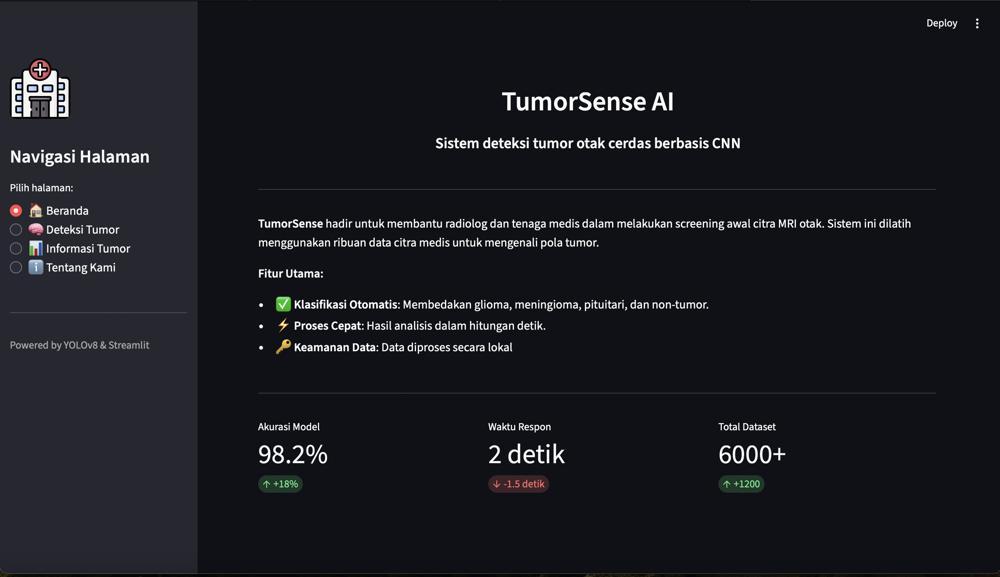
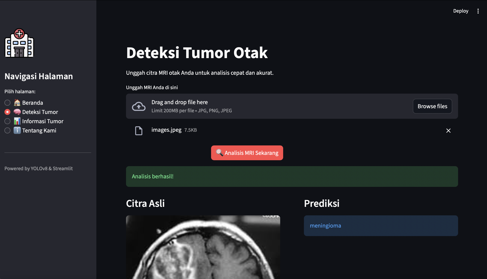

# 🧠 TumorSense - Brain Tumor MRI Detection

**TumorSense** AI is an advanced medical diagnostic support system powered by **YOLOv8 (You Only Look Once)** deep learning technology. This application is designed to classify Brain MRI scans into four distinct categories with high precision and real-time performance.

# 📸 Demo Preview





# ✨ Key Features

- **Real-time Classification:** Instantly detects tumor types from uploaded MRI images (JPG/PNG).

- **High Accuracy:** Fine-tuned on a validated MRI dataset using the YOLOv8-cls architecture.

- **4-Class Detection**:

  - 🔴 **Glioma**
  - 🔵 **Meningioma**
  - 🟡 **Pituitary**
  - 🟢 **No Tumor** (Normal)

- **User-Friendly Interface:** Built with Streamlit for a seamless and responsive web experience.

- **Privacy Focused:** Image processing is done within the application session.

# 📂 Project Structure

The project is structured to ensure smooth deployment on Streamlit Cloud:

```bash
BrainTumorMRIDetection/
├── app/
│ ├── app.py # Main Streamlit Application
│ ├── load_model.py # Load Model Function
│ ├── model_inference.py # Predict Function
│ └── requirements.txt # Minimum dependencies to run app
├── config/
│ └── config.yaml # Configuration files
├── data/
│ └── README.md # About dataset
├── notebooks/
│ ├── experiment.ipynb # Notebook about EDA
│ └── exploration.ipynb # Notebook to check model
├── outputs/
│ ├── plots/
│ │ ├── CNN/ # CNN History Train Plot
│ │ └── YOLO/ # YOLO History Train Plot
│ └── models/
│   └── best.pt # Trained YOLOv8 Model
├── report/ # Report about the application
├── src/
│ ├── __init__.py # To ensure this is python package
│ ├── data_preprocess.py # Preprocess data scripts
│ ├── evaluate.py # Evaluation model scripts
│ ├── model.py # Model creation scripts
│ ├── train.py # Model trains scripts
│ └── main.py # The main entry point
├── requirements.txt # All Dependencies
├── README.md # Project Documentation
├── .gitignore # Ignored files
└── LICENSE
```

# 🚀 Installation & Setup

Follow these steps to run the project locally on your machine.

1. Clone the Repository

```bash
git clone [https://github.com/JasonEvan/TumorSense-AI.git](https://github.com/JasonEvan/TumorSense-AI.git)
cd TumorSense-AI
```

2. Create a Virtual Environment (Recommended)

```bash
# Windows

python -m venv Env
Env\Scripts\activate.bat

# macOS/Linux

python3 -m venv Env
source Env/bin/activate
```

3. Install Dependencies

```bash
pip install -r requirements.txt
```

4. Run the App

Navigate to the root directory and run:

```bash
streamlit run app/app.py
```

# 🧠 Model Information

- **Architecture:** YOLOv8n-cls (Nano Classification)

- **Framework:** Tensorflow & Ultralytics

- **Dataset:** [Brain Tumor MRI Dataset](https://www.kaggle.com/datasets/masoudnickparvar/brain-tumor-mri-dataset)

- **Metrics:**

  - **Accuracy:** 98.32%

  - **Loss:** 0.000805

# ⚠️ Medical Disclaimer

**TumorSense AI is a prototype/educational tool**. It is **NOT** intended to replace professional medical advice, diagnosis, or treatment. The predictions made by this AI model should be verified by a certified radiologist or medical professional.

# 📄 License

Distributed under the MIT License. See LICENSE for more information.
